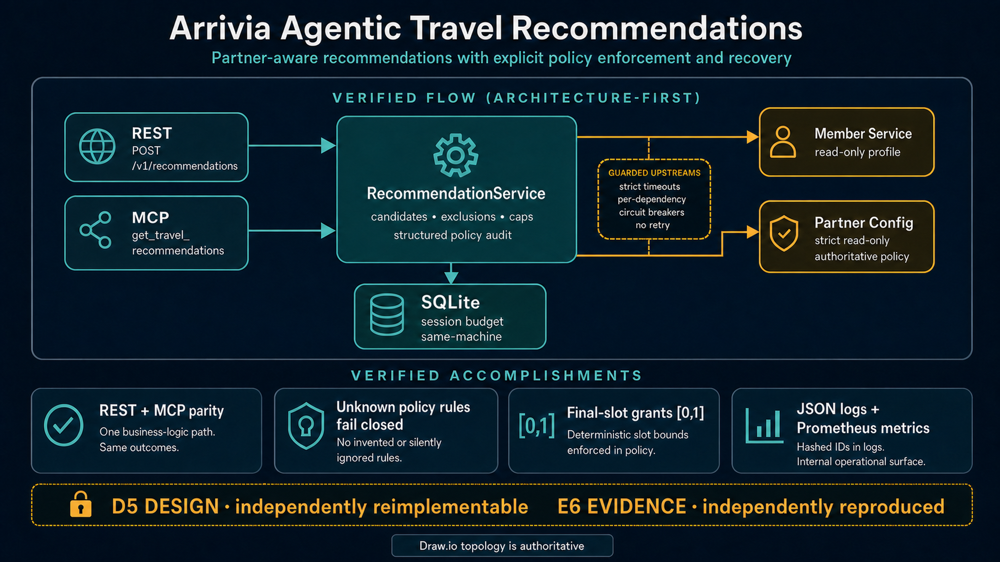

# arrivia Agentic Travel Recommendations API

Internal service for AI-driven, partner-aware travel recommendations that power an "AI Concierge" experience inside partner booking flows. The service combines member context with read-only partner rules and returns recommendations with an audit block so multi-tenant policy decisions stay traceable.



**Current certification: D4 Operable design / E4 candidate-bound local evidence.** Immutable candidate `446679405d41bfd91d6b273e269d35f50afed458` with image digest `sha256:84b02d8bc734e2cb3286fe261ef1cee666117ebeaeb21a6775dfffaaa1f9e720`. D5/E6 remains unclaimed: GPT-5.4 CloudWarm Gate 6 resumed after the maintenance SIGPIPE fix, but locked `pip` install failed on Cloud proxy/index 403 (independent score 6/10).

Verified in the current working candidate:

- REST and MCP both use one `RecommendationService` and translate an open upstream circuit to `upstream_circuit_open` ([contract tests](tests/test_upstream_hardening.py)).
- Partner policy rejects unknown rules and mismatched partner identity instead of inventing defaults ([schema](docs/contracts/partner-policy.schema.json), [tests](tests/test_policy_contract.py)).
- Two independently spawned processes contend for the final SQLite slot and produce grants `[0,1]` with persisted usage equal to the cap ([proof test](tests/test_session_budget_multiprocess.py)).
- JSON completion logs contain the policy audit while member/session identifiers remain hashed; `/metrics` exposes the frozen operational signals ([observability contract](docs/operations/OBSERVABILITY.md)).
- Immutable image rollback preserves `.data` and distinguishes code rollback from database restore ([runbook](docs/operations/ROLLBACK_RUNBOOK.md)).

**Exact claim boundary:** v0 supports one active recommendation-serving replica. REST and MCP may share session-cap state only through the same SQLite file in one filesystem-locking domain (both bare-metal processes, or both inside the container). A Windows host MCP process must not concurrently open the Docker Desktop Linux bind-mounted database; run MCP inside the API container for that topology. The project does not claim production authentication, safe public-internet exposure, multi-replica consistency, uptime, compliance, autonomous policy creation, or independent reimplementability.

Architecture authority and evidence: [six-page draw.io source](docs/architecture/arrivia-system.drawio) · [exact SVG](docs/architecture/arrivia-system.svg) · [Image2 provenance and parity review](docs/portfolio/README.md) · [evidence index](docs/evidence/index.json) · [requirements matrix](docs/design/REQUIREMENTS_TRACEABILITY.md) · [five-minute walkthrough source](walkthrough/README.md)

Goals, constraints, and delivery expectations come from the program brief in `Prompt.md` (maintained outside this repository).

## Constraints From The Brief

- Stack: ship inside arrivia's existing containerized footprint. No new infrastructure layer or third-party platform is introduced here.
- Partner configuration is read-only: this service only reads partner rules and enforces whatever the partner config service returns.
- Four-week first step: scope is limited to what one engineer can credibly ship first and own on call.
- On-call ownership: prefer simple behavior, explicit failures, and clear auditability over hidden fallback logic.
- Multi-tenant boundaries: partner isolation matters, and policy decisions must remain reviewable during incident response.

## Architecture Assumption Matrix

| Assumption | Violation impact | Current defense | Target mitigation | Owner | Validation | Status |
| --- | --- | --- | --- | --- | --- | --- |
| Member and partner-config usually respond inside the timeout budget | Requests fail `502`; repeated dependency failures open a circuit | `0.25/1.0/0.25/0.25s` connect/read/write/pool timeouts, no retry, separate circuits | Tune only from measured histograms and upstream SLOs | Reliability | `tests/test_upstream_hardening.py`, `/metrics` | implemented; live drill pending |
| Member `partner_id` and returned policy `partner_id` agree | Wrong-tenant policy could be enforced | Strict equality check fails closed as `upstream_invalid_payload` | Upstream contract monitoring and signed tenant context | Security/reliability | mismatch contract test | implemented |
| Known policy fields retain schema and meaning | Unsafe policy bypass or evaluator drift | Strict schema, unknown-property rejection, explicit alias conflict handling | Versioned compatibility window before semantic changes | Product/platform | schema and policy tests | implemented |
| One active replica is sufficient for v0 | Multiple independent SQLite files could over-grant a cap | Explicit single-replica claim and rollout guardrail | Shared transactional budget store before horizontal scaling | Service owner | topology review and rollout YAML | accepted v0 |
| `.data` remains on one durable volume and all writers share one filesystem-locking domain | Counts can be lost or SQLite locking can fail across Windows/Docker Linux | Bind mount, WAL mode, stop-before-host-access rule, DB/WAL/SHM snapshot | Shared transactional store before cross-host/kernel writers | Operations | verifier, integrity check, BF-20260716-007 | implemented with topology restriction |
| Session cardinality stays within 10,000 live keys and 1,800s TTL | Disk/lookup pressure and premature eviction | Configured TTL and bounded least-recently-touched pruning | Load test with representative session distribution | Service owner | budget tests and healthy-mock benchmark | harness implemented; representative capacity unmeasured |
| Metrics endpoint and evidence artifacts remain available only to operators/reviewers | Operational metadata leaks or proof becomes unavailable | `METRICS_ENABLED`, no public route auth claim, tracked append-only index | Network policy and durable artifact store in target environment | Operations | metrics gating and link checks | local only |

## Fastest Reviewer Path

This is the recommended challenge-evaluation path because it avoids host/Docker DNS mismatches and uses the checked-in WireMock stubs.

1. Create the Compose env file from the committed template, then start the API plus mocked upstreams:

```powershell
Copy-Item .env.example .env -Force
docker compose --profile mocks up --build
```

Docker Compose reads `.env` for the API container. `.env.example` is the tracked template; edit `.env` only if you need local overrides.

v0 deployment topology for first rollout:

- run a single active API replica
- treat session-cap tracking as same-machine shared state only
- Horizontal scale is deferred until the service has a shared distributed session-state layer
- see `docs/examples/v0-rollout.yaml` for the checked-in rollout guardrail

2. Verify the service is up:

```powershell
curl -s http://127.0.0.1:8080/health
curl -s http://127.0.0.1:8080/ready
```

3. Call the primary REST route with the committed demo member and session:

```powershell
curl -s http://127.0.0.1:8080/v1/recommendations `
  -H "Content-Type: application/json" `
  -d '{"member_id":"m1","session_id":"review-session-1"}'
```

Expected reviewer checks for the sample response:

- `partner_id` is `p1`
- the response includes an `audit` block
- the mock partner policy excludes cruise offers
- the mock partner policy caps the session at `3` recommendations

4. Optional shipped CLI demo over the same primary route:

```powershell
arrivia-recs-demo --member-id m1 --session-id review-session-1
```

5. Record a healthy-mock measurement without asserting a latency SLO:

```powershell
python scripts/healthy_mock_benchmark.py --requests 100 --concurrency 10
```

The report validates every response and records throughput plus p50/p95/max latency. See the
[benchmark contract](docs/operations/BENCHMARK.md) for its exact assertions and claim boundary.

6. If you want to inspect the mock fixtures directly, see:

- `mocks/member-service/mappings/member-m1.json`
- `mocks/partner-config-service/mappings/partner-p1-policy.json`

## MCP Quick Start

The MCP server is a stdio process exposed by `python -m arrivia_recs.mcp.server`.

When the API itself runs in Docker Desktop, launch MCP in that same container/filesystem domain (for
example, an MCP client command equivalent to `docker exec -i <api-container> python -m
arrivia_recs.mcp.server`). Do not concurrently open the bind-mounted SQLite file from Windows and
the Linux container. The host command below is safe when only the mocks run in Docker and both the
API/MCP correctness processes run on the host.

Canonical reviewer-facing surfaces for this challenge:

- Primary HTTP contract: `POST /v1/recommendations`
- Primary MCP tool: `get_travel_recommendations`

If you run the mocks in Docker but run MCP on the host, point the MCP process at localhost instead of the Compose service hostnames:

```powershell
python -m venv .venv
.\.venv\Scripts\Activate.ps1
pip install -e ".[dev]"
$env:MEMBER_SERVICE_BASE_URL="http://127.0.0.1:8081"
$env:PARTNER_CONFIG_BASE_URL="http://127.0.0.1:8082"
python -m arrivia_recs.mcp.server
```

From any MCP-capable client, register the server with this command:

```json
{
  "mcpServers": {
    "arrivia-recs": {
      "command": "python",
      "args": ["-m", "arrivia_recs.mcp.server"],
      "cwd": "."
    }
  }
}
```

Then discover and invoke:

- List tools and confirm `get_travel_recommendations` is available.
- Call `get_travel_recommendations` with `{"member_id":"m1","session_id":"review-session-1"}`.
- Confirm the MCP JSON response includes `partner_id`, `recommendations`, and `audit`.

The MCP tool forwards to the same `RecommendationService` used by `POST /v1/recommendations`, so the main reviewer path is to compare the MCP output with the REST output for the same `member_id` and `session_id`.

Reviewer-visible MCP transcript:

- `docs/examples/mcp-stdio-transcript.md`

Repository-backed MCP proof path:

```powershell
python -m pytest tests/test_mcp_stdio_smoke.py -q
```

That smoke test spawns the real `python -m arrivia_recs.mcp.server` stdio process, uses the official `mcp` client SDK to list tools, and invokes `get_travel_recommendations` against temporary upstream mock servers. The transcript file above mirrors that proof in reviewer-friendly form.

For v0, REST and MCP session-cap parity is only guaranteed when both are evaluated in the same single-machine rollout topology. Cross-host or horizontally scaled session consistency is intentionally deferred.

## Local Setup

Requirements: Python `3.11+`. Docker is optional, but the challenge's fastest successful path is Docker plus WireMock.

```powershell
python -m venv .venv
.\.venv\Scripts\Activate.ps1
pip install -e ".[dev]"
```

For reproducible installs, `requirements.lock` is generated under the pinned Linux/Python 3.12
container, `requirements-dev.lock` captures the Windows evaluation toolchain, and
`requirements-build.lock` pins the container build backend. Prefer the applicable lock over a
fresh unconstrained resolution.

Bare-metal API run:

```powershell
$env:MEMBER_SERVICE_BASE_URL="http://127.0.0.1:8081"
$env:PARTNER_CONFIG_BASE_URL="http://127.0.0.1:8082"
python -m uvicorn arrivia_recs.main:app --reload --host 127.0.0.1 --port 8080
```

The `.env.example` defaults point at Compose-only hostnames (`member-service` and `partner-config-service`). Those names do not resolve on bare metal unless you override them as shown above.

Minimal CLI demo against a running API:

```powershell
arrivia-recs-demo --member-id m1 --session-id review-session-1 --base-url http://127.0.0.1:8080
```

API-only Docker path:

```powershell
Copy-Item .env.example .env -Force
docker compose up --build
```

Reviewer-complete Docker path with mocks:

```powershell
Copy-Item .env.example .env -Force
docker compose --profile mocks up --build
```

## Quality Checks

```powershell
pytest
ruff check .
python -m compileall src tests
```

The authoritative design validators also check schemas, partition ownership, interface hashes, diagram page coverage, and evidence references:

```powershell
python -m pytest tests/test_design_authority.py -q
```

## Judge Proof

This submission is intentionally scoped to a single-active-replica v0. It does not claim horizontally scaled session-cap consistency.

- v0 runs as one active replica only
- same-machine session-cap parity is shipped
- cross-host or multi-replica consistency is intentionally later work

Copy-paste proof command:

```powershell
python -m pytest tests/test_mcp_stdio_smoke.py tests/test_scope_contracts.py -q
```

Reviewer map:

- `docs/examples/judge-proof.md`

## What Ships In v0

- FastAPI service with `/health`, `/ready`, and `POST /v1/recommendations`
- Read-only member and partner-policy adapters backed by WireMock for local development
- Recommendation flow that applies partner caps and exclusions with an auditable `audit` block
- MCP server that exposes `get_travel_recommendations`
- Docker-based local run path and Python package layout under `src/arrivia_recs/`
- Minimal CLI (`arrivia-recs-demo`) for end-to-end reviewer smoke tests against the primary API
- Explicit failure handling for invalid input and upstream failures on the primary REST surface
- Single-active-replica rollout with same-machine session-cap semantics for reviewer and first-production use
- Checked-in rollout guardrail at `docs/examples/v0-rollout.yaml`
- Per-dependency circuit breakers with strict timeouts and no automatic retry
- Newline-delimited JSON logs, internal Prometheus metrics, and executable alert rules
- Immutable-image deployment verification and a SQLite-preserving rollback procedure

## What Comes Later

- Live upstream authn/authz and production secrets management
- Shared distributed session-budget state for horizontal scale across hosts/replicas
- Richer ranking, inventory-aware offers, and experimentation support
- Target-environment dashboards, network policy, measured SLOs, and deployment manifests tuned for arrivia environments

## Four-Week Delivery Plan

| Week | Focus | Exit criteria |
| --- | --- | --- |
| Week 1 | Foundation: repo layout, settings, health/readiness, Docker/Compose, env docs | App boots locally and `/health` plus `/ready` respond |
| Week 2 | Core REST plus policy: member and partner reads, caps/exclusions, auditable responses | `POST /v1/recommendations` respects partner rules and tests cover policy edges |
| Week 3 | MCP: expose recommendation tooling to agent clients | Agent can discover `get_travel_recommendations` and invoke it against a running stack |
| Week 4 | Hardening plus handoff: docs, failure-path polish, quality pass | `pytest`, `ruff`, and compile checks pass and the operator path is documented |

## Ralphy And Codex Workflow

This repository keeps the implementation plan in YAML so Ralphy can drive simultaneous multi-agent execution with the Codex engine.

Prerequisites:

- `npm install -g ralphy-cli`
- an authenticated Codex CLI or Codex desktop session available to Ralphy

Challenge-review workflow example:

```powershell
ralphy --codex --yaml docs/examples/codex-ralphy-review.yaml --parallel --max-parallel 3 -v
```

What that proves for the submission:

- orchestration is declared in checked-in YAML
- Ralphy runs multiple review tracks simultaneously via `parallel_group`
- Codex is the execution engine for those agents
- the workflow converges on one verification pass before submission

That example YAML is reviewer-oriented rather than internal-only. It shows the minimum parallel review loop needed to inspect prompt compliance, runtime behavior, and proof artifacts before final verification.

Phase-by-phase project workflow:

```powershell
ralphy --codex --yaml prd/01-plan.yaml --parallel --max-parallel 3 -v
ralphy --codex --yaml prd/02-setup.yaml --parallel --max-parallel 3 -v
ralphy --codex --yaml prd/03-core-service.yaml --parallel --max-parallel 3 -v
ralphy --codex --yaml prd/04-mcp-ship.yaml --parallel --max-parallel 3 -v
```

Relevant docs:

- `docs/plan/runbook.md`
- `docs/plan/mcp-tools.md`
- `docs/examples/codex-ralphy-review.yaml`
- `docs/examples/judge-proof.md`
- `docs/examples/mcp-stdio-transcript.md`

## Cursor Compatibility Note

This repository does not depend on Cursor-specific orchestration. The shipped multi-agent workflow is Ralphy plus Codex because that is the clearest way to show YAML-based simultaneous agent execution in the repo itself.

If you open the repo in Cursor, the practical reviewer path is still straightforward:

- run the Docker plus mocks flow from this README
- run the MCP stdio server from `python -m arrivia_recs.mcp.server`
- use the checked-in docs and tests as the proof surface

Cursor can act as an editor or MCP client for the same service, but the checked-in orchestration artifact for this submission is `docs/examples/codex-ralphy-review.yaml`, not a Cursor-only workflow.
