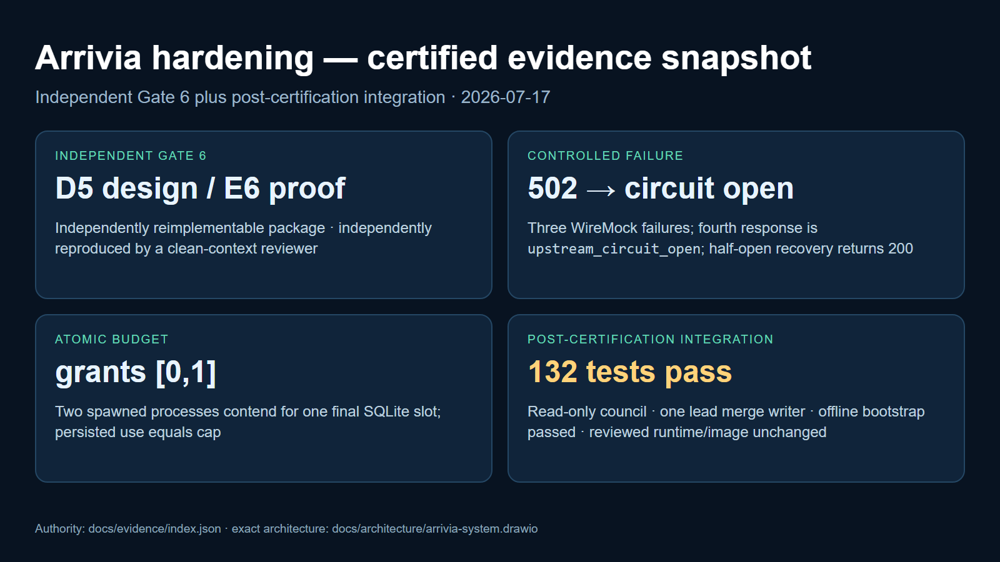

# Evidence gallery

The machine-readable authority is [index.json](index.json), whose envelope is validated by
[evidence-index.schema.json](evidence-index.schema.json) and whose append-only entries use
[evidence-event.schema.json](evidence-event.schema.json). Raw transcripts are retained under
`raw/`; the gallery image is a presentation rendering of those transcripts and is not independent
proof. Failed attempts stay visible in [BREAK_FIX_LOG.md](../../BREAK_FIX_LOG.md).
Text-artifact digests use canonical LF bytes, enforced by `.gitattributes`, so evidence validation
is stable across Windows and Linux checkouts. Binary artifacts are always hashed byte-for-byte.

| Proof | Raw artifact | Current result |
| --- | --- | --- |
| Full suite, CLI, MCP, circuit, logs, metrics | [replacement validation](raw/final-certification/replacement-f5e9dc4-validation.md) | 131 tests in a separate clean checkout and all local runtime journeys passed |
| PR #2 integration | [BF-026](../../BREAK_FIX_LOG.md#bf-20260716-026--merge-main-offline-install-hardening-into-completion-without-rewriting-certification-history) | read-only Grok council + one lead writer resolved five conflicts; 132 tests and no-index offline bootstrap passed; reviewed runtime/image unchanged |
| Healthy-mock benchmark | [replacement benchmark](raw/final-certification/replacement-f5e9dc4-benchmark.json) | 100/100 valid at concurrency 10; latency measurement only |
| Distinct-image rollback | [replacement rollback](raw/final-certification/replacement-f5e9dc4-rollback.md) | SQLite cap preserved across B→A→B; no restore |
| Walkthrough and artifact parity | [post-merge portfolio refresh](raw/final-certification/postmerge-portfolio-refresh.md) | 160/160 frames and every scene boundary reviewed; first/final cards now match D5/E6 and council-assisted integration; Quiet Systems remains duration-fitted and level-checked |
| Earlier failures and superseded proof | [failed Gate 6 review](raw/final-certification/gate6-review-07bbc91-failed.md) | retained; not counted as replacement proof |

The immutable replacement Compose image is `arrivia-recs@sha256:7551188a779f278fbe270348027c8cea213a0c9688dae2bbb5d430c6f8a921d4`, built from source `f5e9dc4df174b1844741efbfb07cb8bdbca3e34c`. Fresh review package `f4c6d5048e9ce655ae90887c28f03d4cc0927be2` independently passed Gate 6, earning D5/E6 within the stated v0 boundary.
